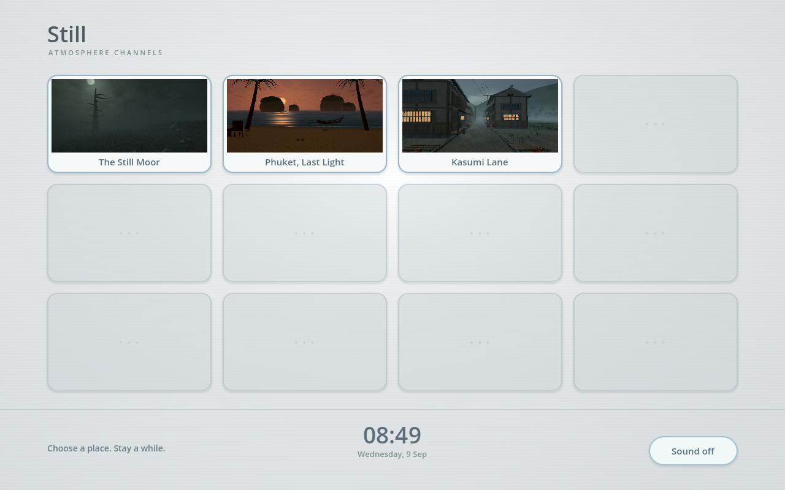
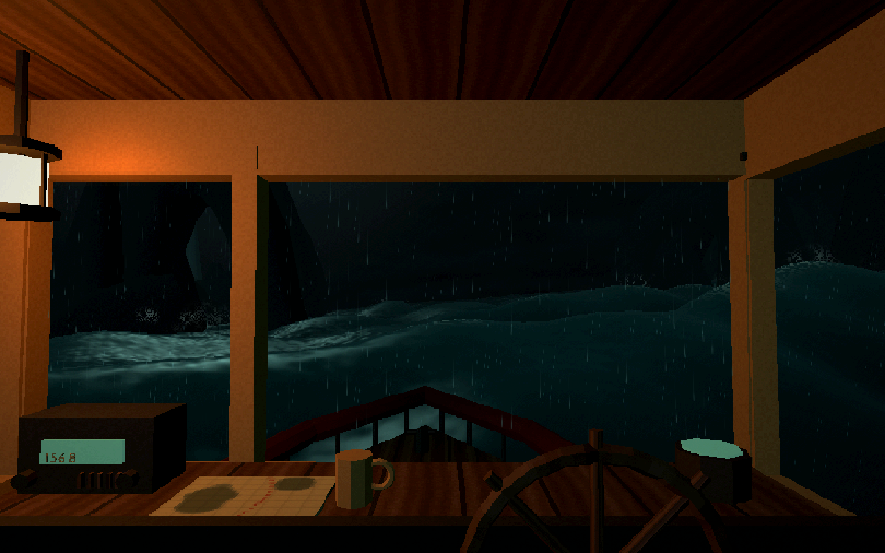
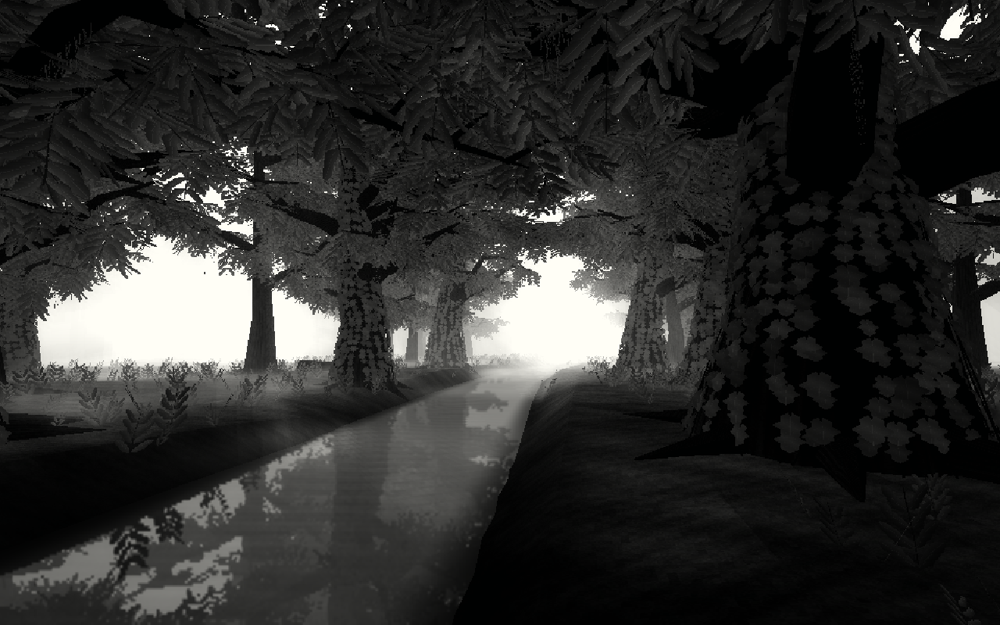
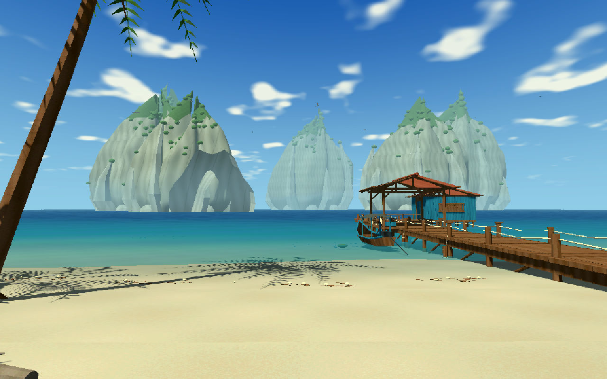
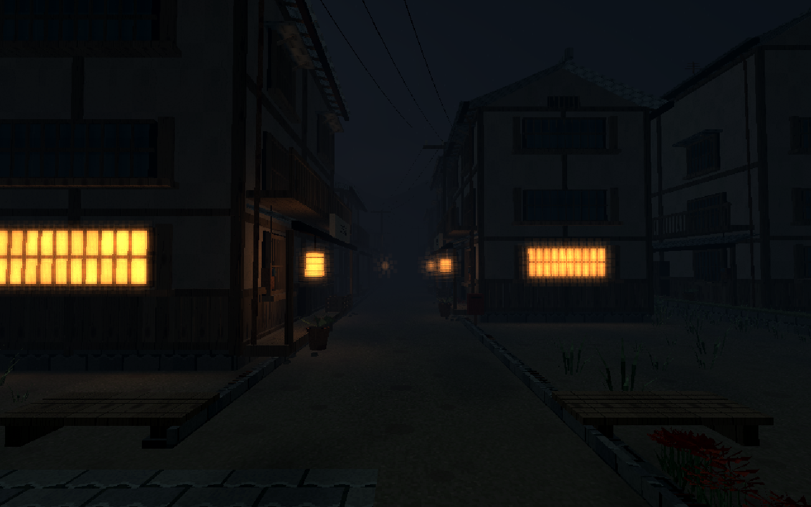
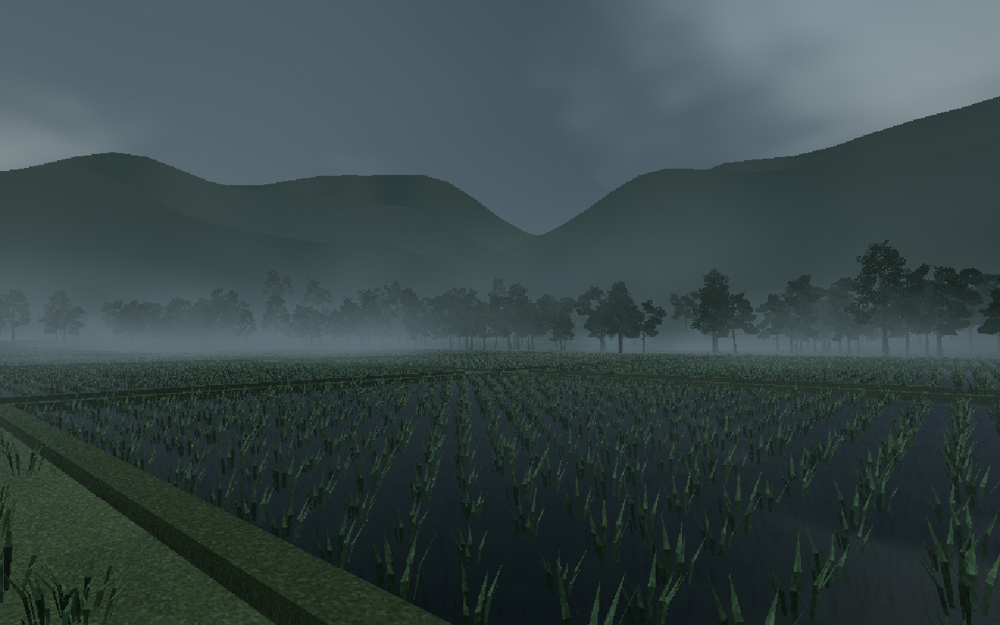
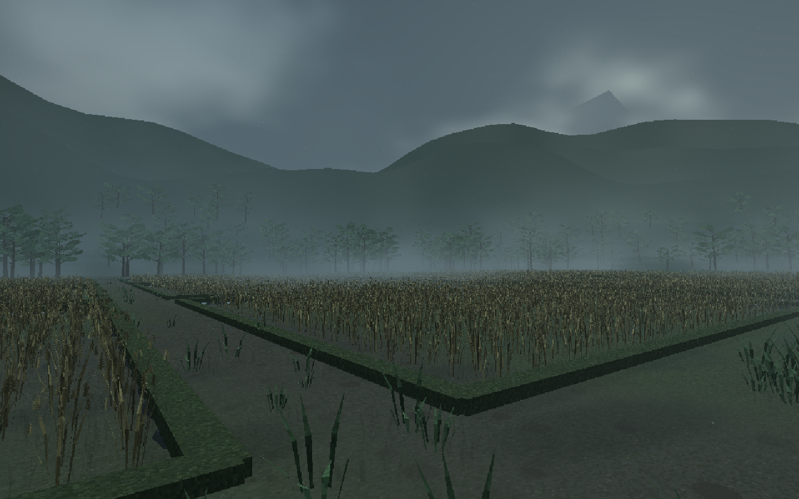

# Still — Atmosphere Channels

**New: La Burrasca** — a torrential storm over a Calabrian coastal village, inspired by Roccella Ionica. A fortified lookout surveys a hilltop church and 75 shuttered houses on cut masonry terraces. Branching sky lightning briefly opens the rain and fog to reveal the roofs and sea; delayed thunder follows. Guarded stairs and seven paved piazzas descend 26 metres through town. Terracotta coppi, louvred shutters, braced iron balconies, stone portals, gutters, wet paving and runoff carry the architectural detail.

Source: `blender/build_roccella.py`, editable `blender/roccella.blend`, `assets/models/roccella.glb`, `assets/data/roccella_layout.json`, original `Roccella*` textures and two storm audio files. Runtime: `roccella.tscn`, `scripts/roccella.gd`, `shaders/roccella_*`. Channel ID: `roccella`; review views: `stairs`, `reverse`, `church`, `balcony`, `coast`. Use `--roccella-time=6.42 --fixed-fps 60` for a lightning thumbnail at the standard capture frame. Native checks: `tests/roccella_visual.gd`; route and behaviour checks: `tests/roccella.gd`. Pause freezes the storm and both audio players; Reset returns to the lookout while retaining storm time.

Ten atmospheric places, modeled in **Blender** and rendered in **Godot 4**. A Wii-inspired channel menu brings them together: full-frame rounded image tiles, subtle scanlines, hover titles, a curved lower dock and a segmented local clock. Selecting a tile expands it to fill the screen; leaving shrinks the current scene back into its channel.

Every experience's settings includes a **Resolution** slider with a live pixel readout. The choice follows you between channels; 100% preserves the original scene detail, and higher settings increase it up to the display size. The interface stays sharp. The matching light loading screen shows real download progress. Use `tools/build.ps1` for publishing: it generates two lossless resource archives and their size manifest to stay within GitHub's file limit.



| Experience | Atmosphere and small stories |
| --- | --- |
| **The Still Moor** | Moonlight through rolling ground fog, wind through rooted grass and ferns, twisted trees and an eroded hollow. The darker grass and ground from the earlier revision are preserved. |
| **Phuket, Blue Bay** | Sunny midday beneath a rich blue sky: towering limestone islands, an eroded sea arch, drifting mountain mist, sun flare, clear turquoise shallows, four independently steering schools of 48 fish and a swimming turtle. Coconut palms shade a working timber pier, tiled pavilion and painted stilt hut; a long-tail boat rocks at its mooring while seabirds circle overhead. |
| **Kasumi Lane** | A compact town at late dusk: varied two- and three-storey timber shops, curved tiled eaves, lattice balconies, roof aerials, warm paper windows and lanterns. A paved backstreet returns to the main lane around a complete block, with gated side alleys and taller background buildings. Fields, kitchen gardens and a wayside shrine remain beyond the town edge, beneath low mist and wooded foothills. |

| **Night Crossing** | A weathered wheelhouse in rough night seas: steep crossing swells, broken whitecaps, wave-driven pitch/roll/heave, eroded sea stacks and a rock arch, distant navigation light, window rivulets, rain, warm cabin lamp, compass, radio and a marked sea chart. Original looping surf, engine throb and timber creaks. A huge whale makes brief moonlit surfacing passes before diving beneath the waves. |






All ten use original modeled geometry and textures. The Painted Mere uses fine ink, translucent watercolour and a higher-resolution scene viewport; the other channels retain their deliberately reduced-resolution treatment. Kasumi now uses researched PS1 art constraints: four 256×256 texture pages, limited palettes, vertex-colored shelter shading and stable perspective-correct architectural UVs. Its models prioritize silhouettes, joinery and readable detail. Phuket uses nine original 256×256 RGB555 material studies, stable surface mapping and authored vertex shading, with carefully modeled palm leaflets, timber joinery and limestone silhouettes. Kasumi and Phuket add no artificial vertex wobble or global film grain. Text and controls remain at display resolution. The environments are meant for slow wandering; there are no objectives or jump scares.

See [Kasumi's hardware research and art decisions](art/PS1_ART_DIRECTION.md), including primary hardware references and the deliberate modern extensions. This is a PS1-inspired Godot experience, not a hardware-accurate console build.




Each scene has its own contrast and fog treatment. The moor retains its depth-based contact shading. Phuket uses directional sunlight, geometric shadows and cool distance haze without screen-space AO. Kasumi uses stable world-space foundation shading, with screen-space AO disabled. Night Crossing uses cabin lighting, geometric overlap and a warm lamp halo without screen-space AO.

## Play and controls

Choose a channel from the menu. **Leave** beside the settings gear in the bottom-right corner. **Leave** returns to the same menu. Sound is off initially; its setting follows you between scenes.

- **Desktop:** selecting a channel locks the pointer for mouse-look. **Esc** releases it without leaving; click the scene to capture it again. **WASD** or **arrow keys** to walk. **Tab / Enter** can select menu buttons.
- **Touch:** the left-thumb joystick walks; a second finger can drag elsewhere to look. Button taps are excluded from camera gestures. Finger ownership, cancellation, focus loss, a dead zone and capped diagonal speed prevent stuck or doubled movement.
- **Settings:** tap the bottom-right gear to expand a vertical stack of controls; tap again to collapse it. Scene titles and lower-left captions are hidden.
- **Sound:** toggles the original ambient loop for the current place. The menu has a quiet sustained chord, the moor has wind, the coast has sea wash, the town has rain, and Night Crossing has rough surf, a low engine and creaking timber.
- **Pause:** freezes the weather and environmental animation while still allowing you to look and walk. Browser reduced-motion preferences initially pause the scene.
- **Night Crossing:** movement is confined to the wheelhouse. **Full motion / Gentle motion** changes hull pitch and roll; the wave heights remain unchanged. The same wave function drives the ocean and hull, and Pause freezes both.
- **Reset:** returns to the opening viewpoint.

The menu reflows for portrait and short landscape windows. The scene camera adjusts its framing for portrait touch screens. Town building footprints block the walking camera; this is otherwise a simple terrain-following walk, not a physics-based character controller.

## GitHub Pages — manual setup

The complete web export is committed in **`docs/`**. In repository **Settings → Pages**, select **Deploy from a branch → main → /docs**, then **Save**. Pages configuration is left to the repository owner.

No build workflow or custom server headers are needed. The single-threaded Compatibility export uses WebGL 2 and WebAssembly; see [Godot's web export documentation](https://docs.godotengine.org/en/stable/tutorials/export/exporting_for_web.html). It loads approximately 40 MB of engine WebAssembly plus an approximately 129 MB game package before starting.

## Edit in Godot or Blender

Built with **Godot 4.7.2 stable** and **Blender 5.2.1 LTS**.

Open `project.godot` and press **F5** to run the channel menu. Open `main.tscn`, `coast.tscn`, `town.tscn`, `sea.tscn`, `lowwater.tscn`, `laundry.tscn` or `reservoir.tscn` and press **F6** to run one place directly.

| File | Purpose |
| --- | --- |
| `blender/hollow_moor.blend` | Editable moor, trees, roots, rocks and vegetation source |
| `blender/night_crossing.blend`, `blender/build_sea.py` | Editable wheelhouse, hull and props, deterministic texture/audio generation; export batches static parts into seven material groups |
| `blender/night_whale.blend`, `blender/build_whale.py` | Original whale with tapered body, long flippers, dorsal fin and animated tail flukes |
| `scripts/sea.gd`, `shaders/sea_*.gdshader*` | Wave geometry, matching hull motion, rain, glass, sea mist and warm lamp bloom |
| `blender/phuket_midday.blend`, `blender/build_phuket.py` | Editable midday shore, limestone islands, coconut palms, working pier, pavilion and long-tail boat |
| `blender/kasumi_town.blend` | Editable houses, roofs, lane, props, shrine and plants |
| `blender/kasumi_plants.blend` | Three branch-and-crown tree studies, rice, wheat, verge grass and lilies |
| `blender/build_kasumi.py` | Deterministic architecture, terrain, field banks, props and plant source |
| `art/kasumi_materials_0.aseprite` through `kasumi_materials_3.aseprite` | Editable 256×256 texture pages with named layers and palettes |
| `art/kasumi_foliage.aseprite` | Cedar, broadleaf and mountain-ash cutouts; crowns use only 84–114 triangles each |
| `art/build_kasumi_atlas.lua` | Aseprite script for the original material studies |
| `blender/build_assets.py` | Deterministic original moor asset generator |
| `blender/build_places.py` | Deterministic coast/town models, textures and ambient loops |
| `assets/models/` | Exported GLBs used by Godot; static objects are joined to reduce draw calls |
| `scripts/menu.gd`, `scripts/session.gd` | Responsive channels, scene transitions and shared sound preference |
| `scripts/main.gd` | Shared viewport, camera, controls and moor assembly |
| `scripts/phuket.gd`, `shaders/phuket_*.gdshader` | Midday lighting, sun flare, transparent shallows, wildlife, pier walking and surface materials |
| `blender/build_phuket_audio.py` | Original stereo surf and coastal bird loop |
| `scripts/kasumi.gd`, `assets/data/kasumi_layout.json` | Town assembly, fields, root-anchored crops, shared terrain heights and building bounds |
| `scripts/touch_controls.gd` | Independent walking and looking gestures |
| `shaders/` | Surface shading, grass/palm/cloth wind, water, fog, rain and menu background |

The `.blend` sources keep editable named objects and architectural groups. They are excluded from automatic Godot importing with `blender/.gdignore`; opening the Godot project uses the committed GLBs and does not require configuring Blender or Aseprite.

The depth-aware fog is a custom ray-marched Compatibility post-process, so it also works in the web export. The original moor uses higher-density ground fog; the coast uses cool mist against sunlit limestone; the town uses low cold mist and rain. Palm deformation is weighted outward from the crown; cloth is weighted down from its anchored top edge. Grass still uses local vertex height, keeping its roots stationary even when imported UV coordinates are flipped.

## Rebuild

Install matching Godot export templates, then use **Project → Export → Web → Export Project** and target `docs/index.html`.

Or use PowerShell:

```powershell
./tools/build.ps1 -Godot 'C:/path/to/godot.exe'
# Regenerate the generated environments from the Blender scripts as well:
./tools/build.ps1 -Godot 'C:/path/to/godot.exe' -Blender 'C:/path/to/blender.exe' -RebuildAssets
# Regenerate the Aseprite pages from Lua as well (overwrites texture-source edits):
./tools/build.ps1 -Godot 'C:/path/to/godot.exe' -Blender 'C:/path/to/blender.exe' -Aseprite 'C:/path/to/aseprite.exe' -RebuildAssets -RebuildTextures
```

The rebuild switch overwrites generated `.blend`, GLB, coast/moor texture and audio files. Kasumi reads the committed Aseprite PNG pages unless `-RebuildTextures` is explicitly supplied. Preserve manual art edits before regeneration. The town generator uses Yu Gothic if available on Windows to turn original shop signs into mesh geometry; it does not bundle the font.

Scene previews are actual Godot renders. To refresh one, run a graphical Godot instance:

```sh
godot --path . --resolution 1280x800 -- --experience=coast --clean-capture --capture=/absolute/path/to/assets/menu/coast.png
godot --path . --resolution 1280x800 -- --experience=town --view=fields --clean-capture --capture=/absolute/path/to/previews/kasumi-fields.png
# Omit --experience and --clean-capture to capture the menu.
```

Reimport preview images before exporting. Commit the source and rebuilt `docs/` together.

## Validation

Audio regressions include `tests/audio_pause.gd` for advancing playback, Pause/Resume, starting sound during Pause, loop boundaries and Reset. To measure the actual web audio backend without loud speaker output, run `node tools/serve_audio_probe.mjs` and open its local address. The diagnostic page counts source starts and buffer copies; ordinary playback must not restart every frame. The probe is excluded from the published game.

```sh
godot --headless --path . --script tests/run.gd
godot --headless --path . --script tests/channels.gd
godot --headless --path . --script tests/kasumi.gd
godot --path . --script tests/kasumi_wind.gd
godot --path . --script tests/kasumi_uv.gd
godot --path . --script tests/kasumi_contact.gd
node tests/validate_web.mjs
# Imported grass root/upper-blade GPU regression, requiring a display:
godot --path . --rendering-method gl_compatibility --script tests/grass_wind.gd
# GPU occlusion: contact shading, clean flat surfaces/sky, and both sample budgets:
godot --path . --script tests/occlusion.gd
# Live native resize and touch-layout regression:
godot --path . --script tests/resize.gd
```

The build runs input tests and round trips through all ten channels, checking sound persistence, UI touch exclusion, emulated-mouse suppression, pause, town building bounds and scene cleanup. Kasumi additionally checks all 25 building footprints, 30 field heights, the connected main lane, imported vegetation roots and texture-page dimensions. Shrine steps and landing heights agree with the walking surface, and solid garden walls block movement. GPU tests confirm rice, wheat and verge roots remain anchored while their tips move, and architectural UVs and world-anchored foundation shading stay fixed across camera translation and rotation. Kasumi uses authored shelter shading and soft world-space contact shade instead of screen-space AO. Its shrine cap and stair treads do not overlap, avoiding coplanar flicker. Desktop, surrounding-landscape and portrait renders are inspected for framing and script/shader errors. The browser export is checked for scene loading, return-to-menu and pause. Its canvas buffer follows CSS dimensions to avoid unnecessary high-DPI rendering cost. The package is checked for WebAssembly/package headers, sizes, relative Pages paths and single-thread configuration.

Physical iOS/Android devices have not been tested. Browser/GPU performance varies; touch devices use a smaller render budget and less moor vegetation. The imported world art remains the same on desktop and touch.

All environment geometry, textures and ambient audio were created for this project. The town and menu use original assets, with no Silent Hill or Nintendo artwork. Godot and its dependencies retain their upstream licenses in `licenses/GODOT_LICENSE.txt` and `licenses/GODOT_THIRD_PARTY.txt`.

### Night Crossing reference and implementation

Mood and first-person framing reference: [Sailing study by Ray_Ervian](https://x.com/ray_ervian/status/2097336882682380306). All shipped models, textures and audio are original; no video assets are included. The sea uses six crossing wave phases, slowly changing wave groups, warped phases and procedural crest foam with wind-carried spray cards. This is an atmospheric boat experience with bounded movement, not a vessel-navigation or fluid-dynamics simulator. The rocks include irregular stacks and an eroded arch. The model keeps named parts in Blender and exports seven material batches for the web. `tests/sea.gd` verifies motion, shared clocks, pause, gentle motion, cabin boundaries and reset.

The hull samples the sea across its footprint, keeping the deck above adjacent crests; water masking is limited to below the solid deck so it cannot cut a visible hole out of a wave. Additional rock groups surround the boat on both sides and astern. Cabin lettering and repeated dot-shaped paint chips have been removed. Rain and window rivulets run downward; glass and spray render after the opaque atmosphere pass.

### Lowwater

An old southern canal beneath spreading oaks, climbing ivy and hanging moss. The supplied Sally Mann landscape references inform the dark foreground, luminous air, enclosing canopy and restrained photographic palette. All geometry, texture pages and audio are original; the photographs are not bundled.

`blender/build_lowwater.py` generates `blender/lowwater.blend`, the batched GLB, five 256×256 texture studies, collision layout and a quiet stereo insect/bird/air loop. The Blender source retains named trunks, connected roots and boughs, climbing foliage, moss, ground and canal surface. `scripts/lowwater.gd` uses the shared controls and scene lifetime; water and trunks block walking, and the right bank has a continuous route.

World-space ray-marched mist gathers around a pale clearing. A smaller second camera produces planar water reflections. A final scene-only photographic print curve deepens blacks and opens the whites, with slight highlight diffusion and warm paper whites. The grade runs inside the scene viewport so transitions preserve it. Moss is anchored at its branch attachments; fog, moss and ripples share Pause. Reset restores the opening bank viewpoint. Reflection resolution follows the desktop/touch render budget.

Run `godot --path . --script tests/lowwater_visual.gd` for native checks of black/white range, rendered Pause, changing atmosphere and populated reflections. `tests/lowwater.gd` checks the walking route, collision, imported terrain heights, mirrored camera and reset. Review angles: `--experience=lowwater --view=canal|reverse|roots|canopy|west`; `--lowwater-time=24` fixes the initial atmosphere time for captures. The menu keeps all five channels visible in portrait and short landscape windows.

### Night Laundry and Reservoir of Columns

**Night Laundry** is a sheltered shop interior with rotating recessed washer drums, intermittent fluorescent ballast flicker, pink/cyan neon, moving window rivulets, wind-driven outdoor rain and wet street light pools. One car approaches, parks, switches off its headlamps, waits, reverses out and leaves; a second car occasionally passes in the opposite lane. The original stereo loop combines machine rumble, a soft mechanical pulse and rain. Machines, glazing, seating, folding counter, vending cabinet and a wire laundry cart constrain walking.

**Reservoir of Columns** is a 266-metre-long chamber with seventy columns and an 84-metre ceiling. Three actual ceiling apertures cast world-space light shafts through drifting dust. Concrete has limited-palette mottling, vertical water stains, formwork ties and a dark waterline. Quiet water reflects the structure with small ripples and localized drip rings. Grounded causeways form a connected route and loop; water blocks walking. An original reverberant drip/air loop supports the immense, quiet space.

`blender/build_interiors.py` regenerates both editable `.blend` files, GLBs, five shared 256×256 texture studies, collision layouts and original audio. `scripts/interior.gd` extends the existing scene framework. Mesh compression is disabled for the exported structures to preserve walking heights. Static laundry parts batch by material; reservoir column rows remain separate culling groups. Both scenes use small planar reflection viewports and scene-local highlight diffusion. Mobile lowers reflection resolution and the reservoir's atmosphere sample count. Pause freezes their material clocks, cars, drums, particles and audio; free look continues and Reset restores the opening viewpoint without rewinding the environment.

`tools/review_interiors.ps1 -ImportAssets -Tests -AllViews` runs headless geometry/behaviour checks, native rendered Pause and lighting checks, and opening/reverse/ceiling/detail/portrait/time-offset captures. Review IDs are `laundry` and `reservoir`; `--interior-time=25` fixes the starting animation phase. Menu thumbnails are actual Godot captures, not the generated concept images.

The revised interiors add warm, localized laundry lighting against the cold rainy street, shaped cars and layered storefronts, upper dryers, curved door glass, moving fabric, stocked folding stations and detailed furniture. Reservoir uses cracked aggregate concrete, jointed paving, submerged column footings, stronger shafts and deeper contrast. Its rounded drain outlet produces a continuous jet, splash particles and expanding rings in the receiving water. `--experience=reservoir --view=pipe` reviews the water interaction; native regression checks that it is visible and that no horizontal column footing coincides with the water plane.

## Signal Grove

A misty conifer forest with a winding, walkable trail, full drooping needle sprays and a feature fir made luminous by fine silver pixel cells. Subtle red through the apparent centre crosses through white to muted cyan toward the edges, mixed with neutral glints rather than solid colour bands. Local patches dim and recover over several seconds; detached square fragments drift upward and fade completely before respawning. The surrounding trees remain quiet, and the channel reuses the original moor wind ambience. Pause freezes the lights, fragments, mist and audio while leaving navigation available; Reset restores the opening camera without rewinding the effect.

`blender/build_signal.py` regenerates `blender/signal_grove.blend`, the GLB, four original texture pages and the terrain/collision layout. The editable source retains 98 named rooted trees, 37,454 fixed light anchors and 1,600 rising fragments. The GPU orients each square around its fixed world anchor, with a close-range size cap. The user-requested colour gradient follows the viewer, while anchors and dimming patches remain fixed to the tree. The hillside and litter texture avoid repeated wave patterns; mip filtering reduces ground shimmer. The rising pass renders after the scene fog and applies matching distance attenuation. No reference photograph is bundled.

Review: `tools/review_signal.ps1 -Godot <executable>` runs native effect checks and captures the opening, close, reverse, side, underneath, trail, ground, foliage, portrait and short landscape views. `-Clip` also captures nine seconds of frames under `build-logs/signal-clip/`. Command-line scene ID: `--experience=signal`; a fixed clock can be set with `--signal-time=13.4`. The standard build includes its route, terrain, collision, drooping foliage, Pause/Resume and Reset regression and all eight channel round trips.

### The Painted Mere

A ninth channel interprets the supplied watercolour-and-ink references as a white-horizon wetland: a supported timber walkway, cupped pink lotus flowers, transparent purple crowns and a small conservatory. Fine geometric pen marks, layered pigment washes, mint colour bleed and world-anchored paper grain give the scene its illustration treatment. Slow water glazes, rising bubble outlines and an original quiet water/bird loop follow Pause; Reset retains scene time.

`blender/build_painted.py` regenerates the editable `blender/painted_mere.blend`, GLB, paper study, route layout and audio. Runtime: `scripts/painted.gd`, `painted.tscn`, and `shaders/painted_*`. See [the technique and tool decisions](art/PAINTED_MERE.md). Run `tests/painted.gd` for route/collision/clock checks and `tests/painted_visual.gd` in native Godot for visual/Pause checks and multi-angle captures. The new channel shares desktop/touch controls and appears in the responsive menu.

The Painted Mere now includes nine ink-lined flamingos with gentle independent neck movements, standing and one-leg poses, and occasional pigment spills beyond selected flower, leaf, tree and bird outlines. The wildlife remains Blender-authored; animation and sound follow Pause. See `art/PAINTED_MERE.md` for the overflow and wildlife source details.
