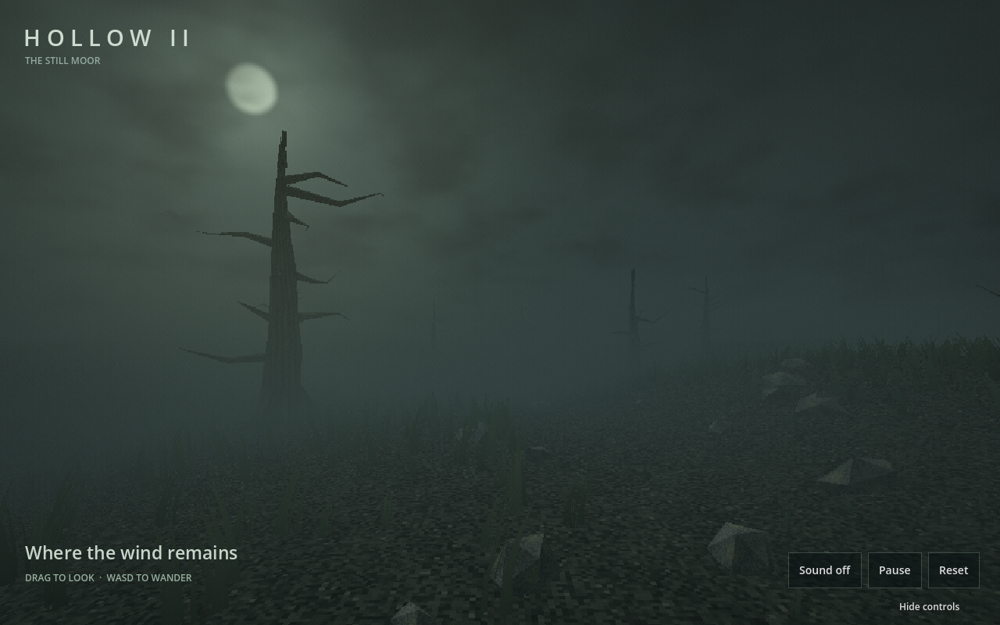

# Hollow II — The Still Moor

A richer version of the moonlit PS1 moor, modeled in **Blender** and running in **Godot 4**. It keeps the desaturated palette, angular silhouettes, coarse textures, and dithering, with more detailed art and a deeper atmospheric scene.



## GitHub Pages — manual setup

The complete, prebuilt web game is committed in **`docs/`**.

1. Open **Settings → Pages** in this repository.
2. Select **Deploy from a branch**.
3. Select **main** and **/docs**, then **Save**.

No build workflow or server setup is required. Pages settings have deliberately been left for you to configure. The export is single-threaded, so it does not require custom cross-origin isolation headers. See [Godot's web export documentation](https://docs.godotengine.org/en/stable/tutorials/export/exporting_for_web.html).

The web version downloads approximately 40 MB of WebAssembly plus a 3 MB game package before starting. WebGL 2 and WebAssembly are required. Native Godot runs have more performance headroom than a mobile browser.

## What changed from game14

- An editable Blender landscape with nine twisted trees, exposed roots, splintered crowns, individual branches, 180 angular stones, and an eroded hollow.
- Original 128×128 bark, peat, and lichen textures with nearest filtering.
- Blender grass and fern meshes, instanced in spatial chunks and animated on the GPU. Wind strength uses local vertex height to keep roots anchored despite flipped glTF texture coordinates; desktop and mobile use different density budgets.
- Depth-aware fog with 3D noise, low rolling ribbons, moonlit scattering, drifting clouds, and a soft moon halo.
- A separate low-resolution 3D viewport: up to 960×640 on desktop and 640×480 on touch devices. Interface text stays at display resolution.
- Subtle vertex snapping, quantized colors, ordered dithering, and film grain.
- A pre-rendered wind loop, avoiding real-time audio-generation limitations in the browser.

Fog is a custom Compatibility-renderer post-process, rather than Godot's Forward+ volumetric fog. This lets the same scene export to WebGL 2.

## Controls

**Touch:** left-thumb joystick to walk; drag elsewhere with a second finger to look. Gestures have separate finger ownership, a dead zone, capped diagonal speed, and cancellation/focus-loss handling. Button touches do not move the camera.

**Desktop:** drag to look; **WASD** or **arrow keys** to walk. **H** hides the interface. The on-screen controls toggle sound, pause the atmospheric animation, and reset the view. The joystick stays available when the interface is hidden. Sound starts only after tapping its button. Reduced-motion browser preferences initially pause animation.

Portrait framing widens the horizontal camera view so the moon and foreground tree remain in the opening composition.

## Edit the project

Tested with **Blender 5.2.1 LTS** and **Godot 4.7.2 stable** (standard GDScript edition, Compatibility renderer).

- Open **`project.godot`** in Godot and press **F6/F5** to run the main scene.
- Open **`blender/hollow_moor.blend`** to edit the modeled environment. Individual trees, branches, roots, rocks, and source plant meshes remain separate in the Blender file.
- `assets/models/moor.glb` is the joined runtime environment; `grass_tuft.glb` and `fern.glb` are reusable models.
- `scripts/main.gd` assembles the scene and interface; `scripts/touch_controls.gd` owns touch input.
- `shaders/` contains ground/tree shading, wind deformation, and depth-based atmosphere.

The `.blend` is excluded from Godot's automatic importer using `blender/.gdignore`. Godot loads the committed GLBs, so opening the project does not require configuring Blender in Godot.

## Rebuild

Godot's matching export templates must be installed. In the Godot editor, use **Project → Export → Web → Export Project**, targeting `docs/index.html`.

Or use PowerShell with paths to your installed engines:

```powershell
./tools/build.ps1 -Godot 'C:/path/to/godot.exe'
# Recreate the art from the deterministic Blender script as well:
./tools/build.ps1 -Godot 'C:/path/to/godot.exe' -Blender 'C:/path/to/blender.exe' -RebuildAssets
```

`-RebuildAssets` recreates the original art and overwrites the generated `.blend`, GLBs, textures, and wind loop. Preserve any manual art edits first. Commit both source and rebuilt `docs/` output.

Manual test commands:

```sh
godot --headless --path . --script tests/run.gd
node tests/validate_web.mjs
# GPU regression: roots stay still while upper blades move (requires a display).
godot --path . --rendering-method gl_compatibility --script tests/grass_wind.gd
```

## Validation and limitations

- Blender generation and GLB export completed successfully.
- Godot imported the project and rendered desktop and portrait previews without script or shader errors.
- A GPU regression renders the imported grass at two wind phases and verifies a stationary root silhouette with moving upper blades.
- Input tests cover simultaneous fingers, ownership, cancellation, focus loss, UI exclusion, dead zone, and speed limiting.
- The exported game loaded and rendered in the in-app Chromium browser, and its Pause button changed to Resume correctly.
- The release web export was generated and its files, sizes, WebAssembly header, package header, and project-relative paths were validated.
- Physical iOS/Android devices have not been tested. Compatibility varies with browser and GPU; reduced grass density and fog sample count are selected for touch devices.
- Movement is an atmospheric camera walk grounded to the terrain, not a physics-based game with obstacle collision or objectives.

All modeled assets, textures, wind audio, and project-specific code were created for this scene. Godot's exported engine and its third-party notices retain their upstream licenses; see [Godot's license](https://godotengine.org/license/).


